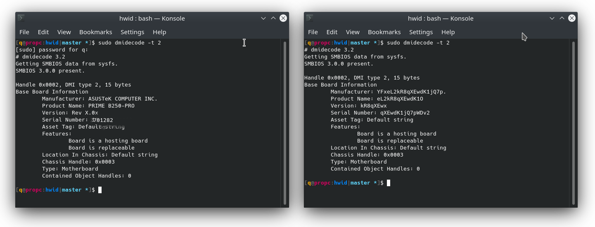

**Archival note:** I put this together when I was 16-17, and as you can imagine, the code and repo quality reflect that. I am keeping this here for archival purposes.

---

# negativespoofer
[Based on Clover's bootloader SMBIOS patching method](https://github.com/CloverHackyColor/CloverBootloader/blob/22f9adcbc97e1291bc2361d69b66f96a29af0d05/rEFIt_UEFI/Platform/smbios.cpp) *negativespoofer* spoofs SMBIOS tables before the boot of the OS.

  

## Useful links
To make this repo more readable, I made different pages for different topics.
- [How to compile (Linux)](pages/LINUX.md)
- [How to compile (Windows)](pages/WINDOWS.md)
- [How to use](pages/USE.md)
- [Reporting issue](pages/BUGS.md)
